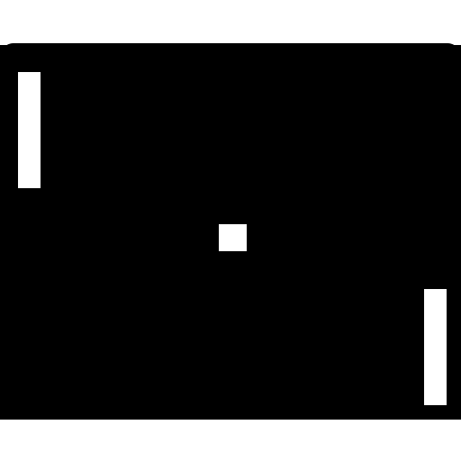

<!--
    Copyright © 2022 Marlon de Oliveira Gomes.
    MIT License

    Project: Pong-Lua
    A remake of the classic Atari game Pong in Lua.

    File: README.md
    Program constants to be shared across various files.

    Contact: 72144990+Marlon-Gomes@users.noreply.github.com
-->
<div id="top"></div>

<!-- PROJECT SHIELDS -->
<!--
TODO: Add shields related to testing, building, and so on.
-->
[![Contributors][contributors-shield]][contributors-url]
[![Forks][forks-shield]][forks-url]
[![Stargazers][stars-shield]][stars-url]
[![Issues][issues-shield]][issues-url]
[![MIT License][license-shield]][license-url]

<!-- PROJECT LOGO -->
<br />
<div align="center">
  <a href="https://github.com/Marlon-Gomes/pong-lua">
    
  </a>

<h3 align="center">Pong-Lua</h3>

  <p align="center">
    The classical Atari game, coded in Lua!
    <br />
<!--    <a href="https://github.com/Marlon-Gomes/pong-lua"><strong>Explore the docs »</strong></a>
    <br />
    <br />
    <a href="https://github.com/Marlon-Gomes/pong-lua">View Demo</a>
    ·
-->
    <a href="https://github.com/Marlon-Gomes/pong-lua/issues">Report Bug</a>
    ·
    <a href="https://github.com/Marlon-Gomes/pong-lua/issues">Request Feature</a>
  </p>
</div>


<!-- TABLE OF CONTENTS -->
<details>
  <summary>Table of Contents</summary>
  <ol>
    <li>
      <a href="#about-the-project">About The Project</a>
      <ul>
        <li><a href="#built-with">Built With</a></li>
      </ul>
    </li>
    <li>
      <a href="#getting-started">Getting Started</a>
      <ul>
        <li><a href="#macos">MacOS</a></li>
        <li><a href="#love-app">Love App</a></li>
        <li><a href="#build-from-source">Build from Source</a></li>
      </ul>
    </li>
    <li><a href="#usage">Usage</a></li>
    <li><a href="#roadmap">Roadmap</a></li>
    <li><a href="#contributing">Contributing</a></li>
    <li><a href="#license">License</a></li>
    <li><a href="#contact">Contact</a></li>
    <li><a href="#acknowledgments">Acknowledgments</a></li>
  </ol>
</details>


<!-- ABOUT THE PROJECT -->
## About The Project


![Product Name Screen Shot][welcome-screenshot]

Pong is a classic game that simulates table tennis, released for Atari in 1972.
The game features two paddles, controlled by the players, which move vertically
across the left and right sides of the screen. Additionally, the game features
a ball, which travels across the screen, bouncing off the top and bottom edges
and the paddles. Players must try to hit the ball with their paddles to prevent
it from falling off the vertical edges of the screen. A player scores when the
opposing player fails to catch the ball. The first player to score 11 points
wins.

This project implements Pong with the Lua programming language, using the LÖVE2D
framework. It is based on Harvard University's 2018 CS50 course, taught by
Colton Ogden. The lectures are available on this
[Youtube playlist][youtube-link].

<p align="right">(<a href="#top">back to top</a>)</p>


### Built With

<table>
  <tr>
    <td>
        
    </td>
    <td>
        <a href="https://lua.org/" target = "_blank">Lua
        </a> a lightweight scripting language.
    </td>
  </tr>
  <tr>
    <td>
        
    </td>
    <td>
    <a href="https://love2d.org/" target = "_blank">LÖVE2D
    </a> a framework for 2D game development in Lua.
    </td>
  </tr>
 </table>

<p align="right">(<a href="#top">back to top</a>)</p>

<!-- GETTING STARTED -->
## Getting Started

To get a local copy up and running follow these simple example steps.


### MacOS
The MacOS version of the game runs natively on Intel-based Macs. It has been
tested on MacOS Monterey 12.2.1.

### Love App
The .love release file can be used in conjunction with the Love app in any 
system that supports Love. For details on how to install Love for your specific
platform, consult the LÖVE2D [webpage](https://love2d.org). Once Love is
installed, just double click the .love file.

### Build from Source

1. Clone the repo
   ```sh
   git clone https://github.com/Marlon-Gomes/pong-lua.git path/to/your/repo
   ```
2. Run the build script:
    - Build for Love
        ```sh
        cd path/to/your/repo
        ./build.sh -t love
        ```
        or,
    - Build for MacOS
        ```sh
        cd path/to/your/repo
        ./build.sh -t macos
        ```

For more info on ```build.sh```, use the help flag
```sh
cd path/to/your/repo
./build.sh -h
```
<p align="right">(<a href="#top">back to top</a>)</p>

<!-- USAGE EXAMPLES -->
## Usage

The game is played with 5 keys:
- W, S for player 1
- Up, Down for player 2
- Enter/Return to cycle between game stages.

Pressing Enter/Return from the welcome screen initializes play mode.

![Gameplay screenshot][gameplay-screenshot]

Players must use their controls to hit the ball with the paddle. If a player 
misses, the other player scores; the scoring player serves the next round.

![Service screenshot][service-screenshot]

The first player to score 11 points wins!

![Victory screenshot][victory-screenshot]

<p align="right">(<a href="#top">back to top</a>)</p>

<!-- ROADMAP -->

## Roadmap

- [ ] Add unit tests.
- [ ] Add build systems for other platforms.

See the [open issues](https://github.com/Marlon-Gomes/pong-lua/issues) for a 
full list of proposed features (and known issues).

<p align="right">(<a href="#top">back to top</a>)</p>

<!-- CONTRIBUTING -->
## Contributing

Any contributions you make are **greatly appreciated**. If you have a suggestion
that would make this better, please fork the repo and create a pull request. You
can also simply open an issue with the tag "enhancement".

1. Fork the Project
2. Create your Feature Branch by branching from develop
```sh
git checkout -b feature/AmazingFeature develop
```
3. Commit your Changes
```sh
git commit -m 'Add some AmazingFeature'
```
4. Push to the Branch
```sh
git push origin feature/AmazingFeature
```
5. Open a Pull Request

<p align="right">(<a href="#top">back to top</a>)</p>

<!-- LICENSE -->
## License

Pong-lua is distributed under the MIT License. See `LICENSE.txt` for more
information.

Pong-lua relies on source code and media files that are subject to licenses of 
their own. Please consult the third-party licenses
[README.md][third-party-licenses-url] for a list containing links to individual
licenses.

<p align="right">(<a href="#top">back to top</a>)</p>

<!-- CONTACT -->
## Contact

Marlon de Oliveira Gomes - 72144990+Marlon-Gomes@users.noreply.github.com

Project Link: [https://github.com/Marlon-Gomes/pong-lua][project-link]

<p align="right">(<a href="#top">back to top</a>)</p>

<!-- ACKNOWLEDGMENTS -->
## Acknowledgments

* This code is based on [Colton Ogden](https://github.com/coltonoscopy)'s
interpretation of the game. It was the subject of a lecture in his CS50 course
at Harvard in 2018. The original repo can be found at
https://github.com/games50/pong.
* This project uses Ulysse Ramage's [push][push-repo] library to handle the
game's resolution.
* Classes are not native to the Lua languange. The implementation of classes
used here, <code>class.lua</code>, is part of the [hump][hump-docs] package, a
suite of tools for game development in the LÖVE framework due to Matthias
Richter.
* Sound effects were generated with [jsfxr][jsfxr]. Many thanks to the
contributors of the project.
<p align="right">(<a href="#top">back to top</a>)</p>

<!-- MARKDOWN LINKS & IMAGES -->
<!-- https://www.markdownguide.org/basic-syntax/#reference-style-links -->
[contributors-shield]: https://img.shields.io/github/contributors/Marlon-Gomes/pong-lua.svg?style=for-the-badge
[contributors-url]: https://github.com/Marlon-Gomes/pong-lua/graphs/contributors
[forks-shield]: https://img.shields.io/github/forks/Marlon-Gomes/pong-lua.svg?style=for-the-badge
[forks-url]: https://github.com/Marlon-Gomes/pong-lua/network/members
[stars-shield]: https://img.shields.io/github/stars/Marlon-Gomes/pong-lua.svg?style=for-the-badge
[stars-url]: https://github.com/Marlon-Gomes/pong-lua/stargazers
[issues-shield]: https://img.shields.io/github/issues/Marlon-Gomes/pong-lua.svg?style=for-the-badge
[issues-url]: https://github.com/Marlon-Gomes/pong-lua/issues
[license-shield]: https://img.shields.io/github/license/Marlon-Gomes/pong-lua.svg?style=for-the-badge
[license-url]: https://github.com/Marlon-Gomes/pong-lua/blob/main/LICENSE.txt
[welcome-screenshot]: docs/images/welcome_screen.png
[gameplay-screenshot]: docs/images/gameplay_screen.png
[service-screenshot]: docs/images/service_screen.png
[victory-screenshot]: docs/images/victory_screen.png
[hump-docs]: https://hump.readthedocs.io/en/latest/#
[love-logo]: docs/images/love_logo.png
[lua-logo]: media/images/lua_logo.png
[third-party-licenses-url]: THIRD_PARTY_LICENSES/README.md
[push-repo]: https://github.com/Ulydev/push
[jsfxr]: https://github.com/chr15m/jsfxr
[youtube-link]: https://www.youtube.com/playlist?list=PLWKjhJtqVAbluXJKKbCIb4xd7fcRkpzoz
[project-link]: https://github.com/Marlon-Gomes/pong-lua